# Technical Report: Cloth Segmentation System
**Project:** Fashionpedia Semantic Segmentation

## 1. Dataset Choice and Rationale

**Dataset:** Fashionpedia 
**Classes:** 47 categories and 13 supercategories (including Upperbody, Lowerbody, Decorations, Closures, etc.)

For this project, I used supercategories as classes for simplicity

**Reasons for Selection:**
1.  **Size:** Dataset contains more 45 thousand images and more than 300 thousand annotations.
2.  **Complexity:** The dataset handles complex scenarios such as occlusion (layering of clothes), non-rigid deformations, and varied poses.

## 2. Model Architecture

I employed a **U-Net** architecture utilizing a pretrained Transformer-based encoder.

*   **Architecture Family:** U-Net
*   **Encoder Backbone:** MIT-B1 (Mix Transformer)
*   **Pre-training:** ImageNet
*   **Input Resolution:** $512 \times 512$ pixels
*   **Output:** Pixel-wise class probabilities for 13 classes
*   **Frameworks/Libraries:** PyTorch Lightning, segmentation-models-pytorch

## 3. Loss Function Selection

Used a composite loss function combining **Dice Loss** and **Focal Loss**:

$$ \text{Total Loss} = 0.5 \times \text{Dice Loss} + 0.5 \times \text{Focal Loss} $$

**Rationale:**
1.  **Focal Loss:** This is an improvement over Cross-Entropy. It dynamically scales the loss, reducing the weight of easy-to-classify examples (background) and focusing the model on hard-to-classify examples (boundaries, small accessories like buttons).
2.  **Dice Loss:** This directly optimizes the overlap (Dice coefficient) between the predicted segmentation and the ground truth. It prevents the model from achieving a low loss simply by predicting the background class everywhere.

## 4. Performance Analysis

The model was trained for **7 epochs** with Early Stopping and Model Checkpointing.

### Quantitative Metrics
The evaluation was performed on the validation set using **Macro-averaging** (treating all classes as equally important regardless of size).

| Metric | Score Achieved | Description |
| :--- | :--- | :--- |
| **mIoU** (Jaccard Index) | **0.544** | The intersection-over-union implies the model correctly identified ~54% of the target pixels across all classes. |
| **F1 Score** (Dice Coeff) | **0.679** | The harmonic mean of precision and recall. |

#### Training graphs
**Training Dice Loss Score:**
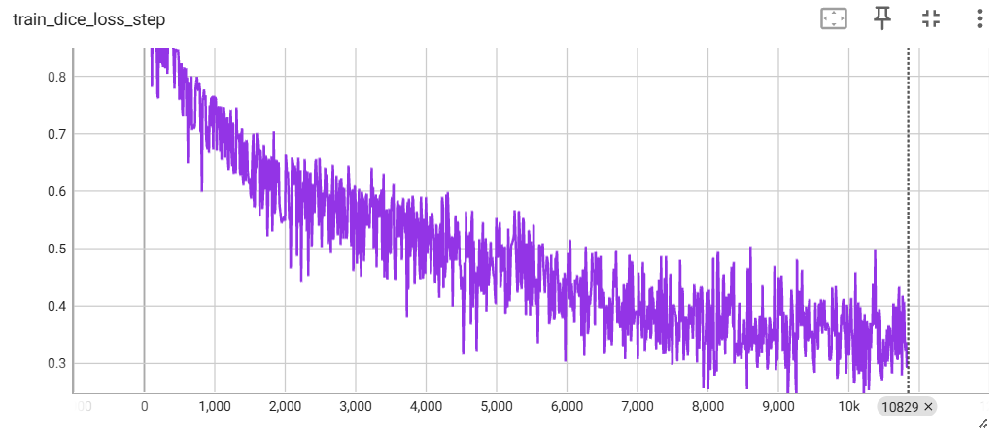

**Training Loss:**
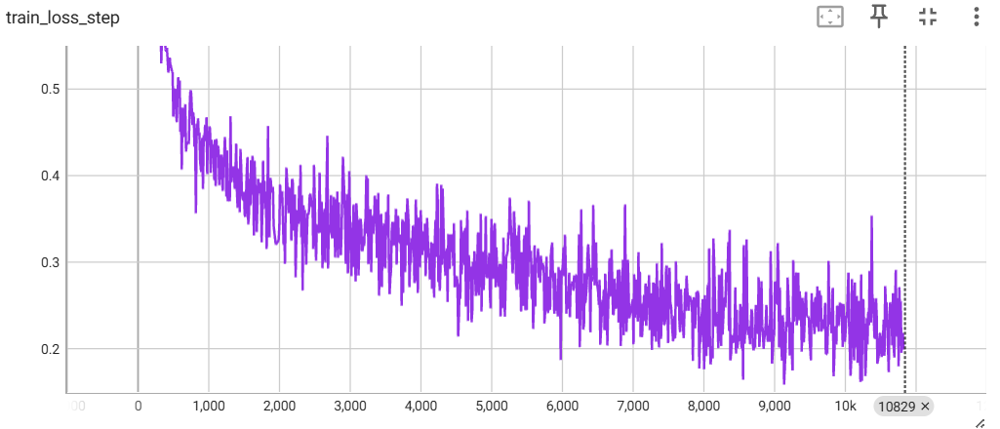

**Validation Loss:**

**Validation mIoU:**
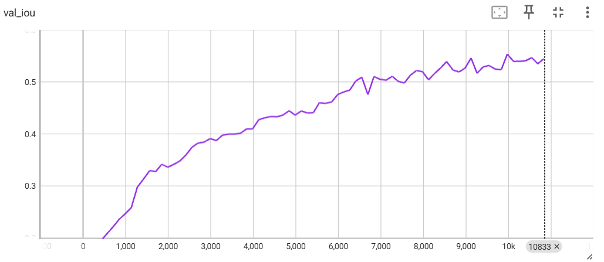

**Validation F1 Score:**
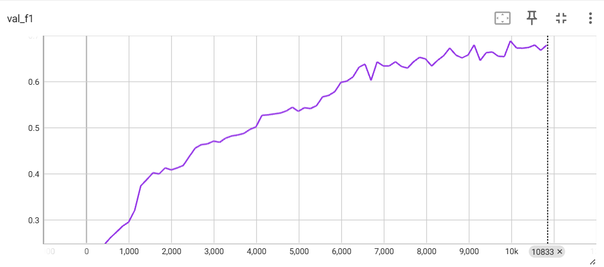

### Testing on Sample Images
**Image 1:**
| Original | With Mask |
|---------|---------|
|  | 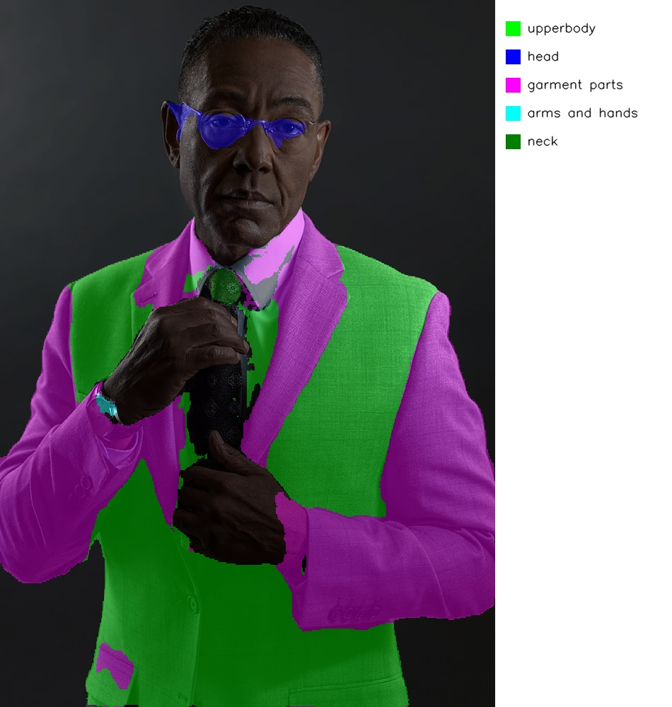 |

**Image 2:**
| Original | With Mask |
|---------|---------|
| 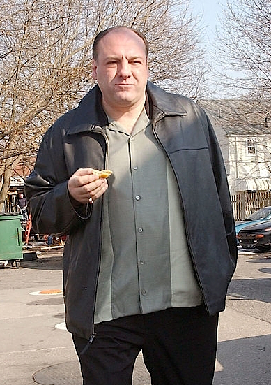 | 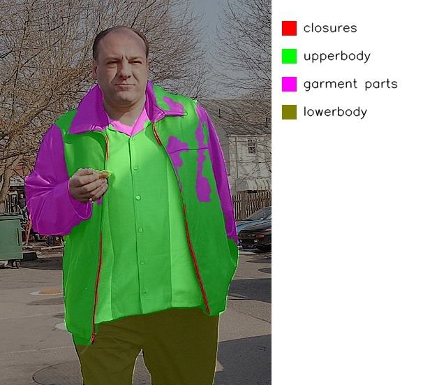 |

**Image 3:**
| Original | With Mask |
|---------|---------|
|  | 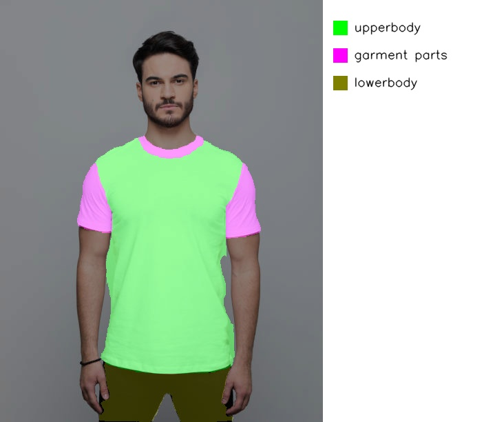 |

**Image 4:**
| Original | With Mask |
|---------|---------|
| 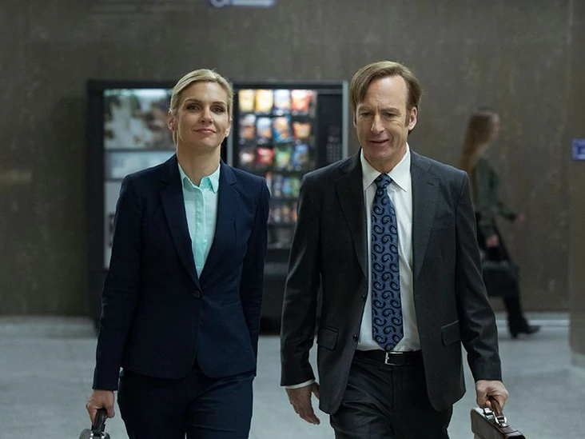 | 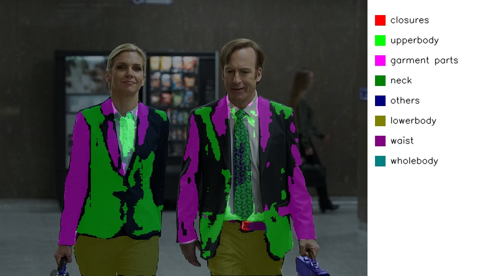 |

**Image 5 (Failed):**
| Original | With Mask |
|---------|---------|
|  | 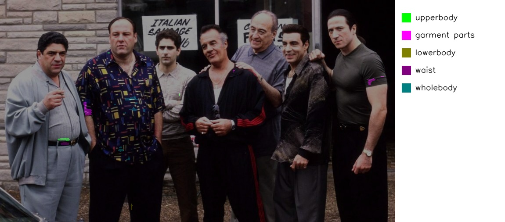 |

## 5. Limitations and Future Work

1.  **Multi Person Photos:** The model struggles with images containing multiple individuals, as the number of people increases, the model can detect all background.
2.  **Small Accessories:** Items like buttons, zippers, and small decorations are often missed or misclassified.
3.  **Overlapping Clothes:** The model has difficulty accurately segmenting overlapping garments, especially when colors and textures are similar.

