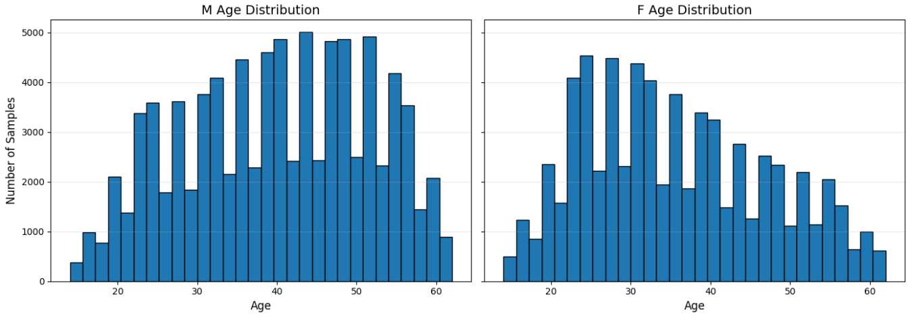
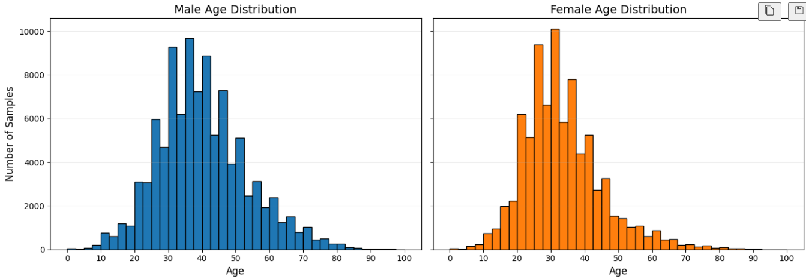
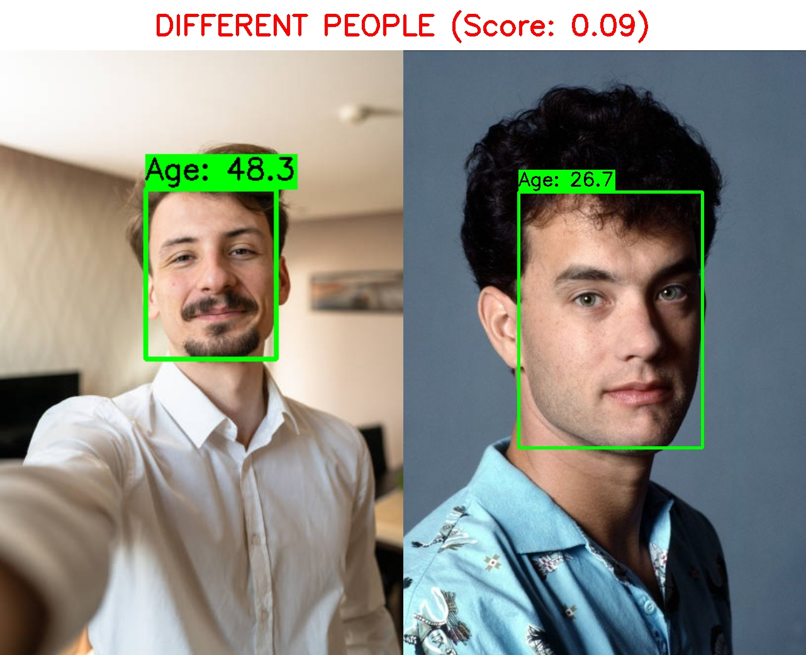
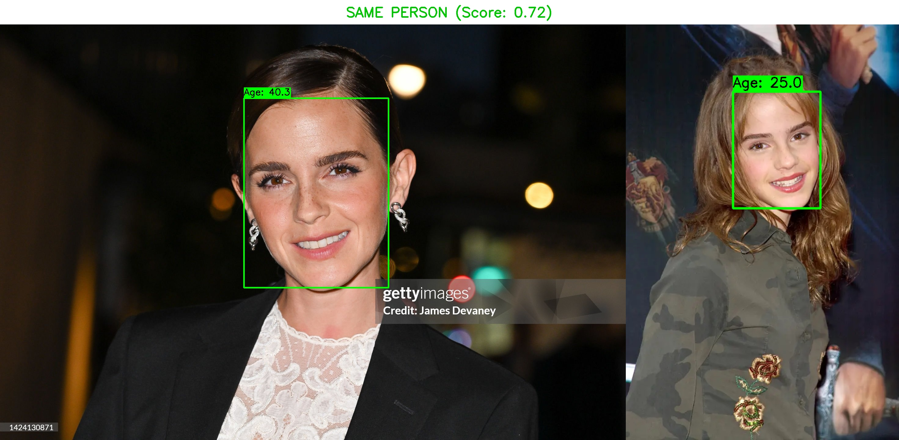
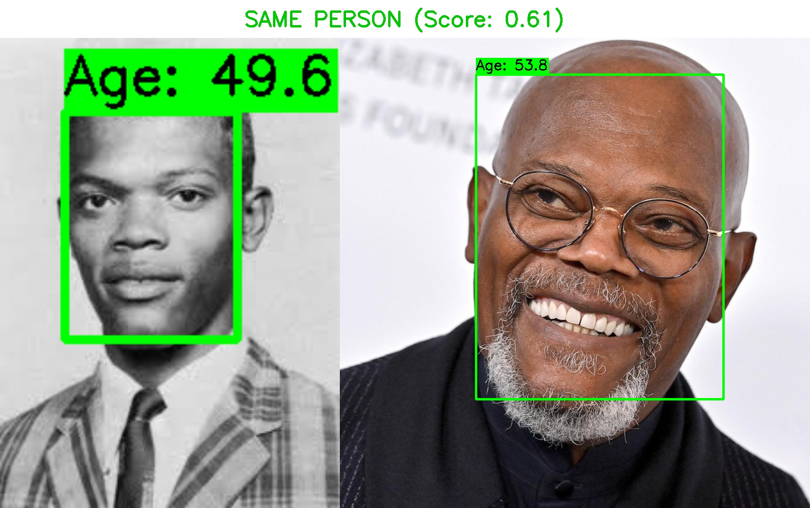
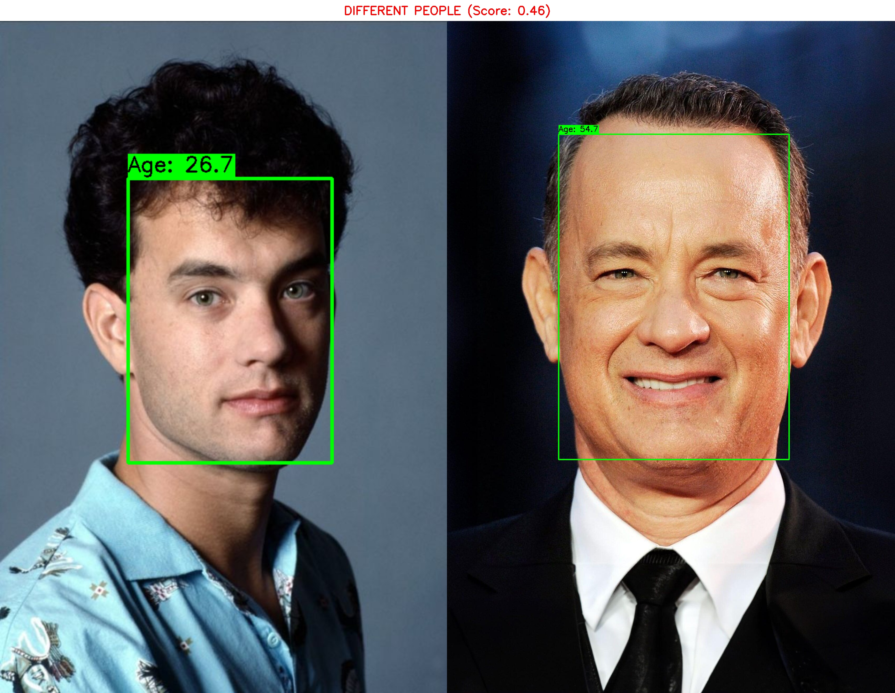

# Face Matching and Age Prediction - Technical Report


## 1. Dataset Choice and Rationale
In this task, I experimented with two primary datasets for training the age prediction and face verification models: CACD (Cross-Age Celebrity Dataset) and IMDB-WIKI. 
### Dataset: CACD (Cross-Age Celebrity Dataset)

**Source:** `pdombrza/cacd-filtered-dataset` from Kaggle

**Dataset Characteristics:**
- Celebrity face images with annotated ages
- Filtered version ensuring quality and consistency
- Contains faces across a wide age range (0-100 years)
- Includes gender information (sex) for additional context
- Pre-aligned and cropped face images

**Rationale for Selection:**

1. **Age Range Coverage:** CACD provides comprehensive age 15  to 60 with sufficient samples across all age groups, enabling robust age prediction.


2. **Quality and Consistency:** The filtered version ensures:
   - Proper face alignment
   - Consistent image quality
   - Reliable age annotations verified against celebrity birth records
   - Minimal label noise compared to web-scraped alternatives


### Dataset: IMDB-WIKI
**Source:** [https://data.vision.ee.ethz.ch/cvl/rrothe/imdb-wiki/]

**Dataset Characteristics:**
- Large-scale dataset with 523,051 face images from IMDB and Wikipedia
- Annotated with age and gender
- Large variety of poses, lighting, and expressions
- Higher range of ages (0-100 years)



**Dataset Split:**
- **Training Set:** 80% of the dataset
- **Validation Set:** 20% of the dataset
- **Split Strategy:** Random stratified split maintaining age distribution balance
---

## 2. Age Prediction Model Architecture

### Overview
The age prediction system uses a fine-tuned **InceptionResnetV1** backbone pretrained `vggface2`, combined with a custom regression head to output age distributions.

### Architecture Components

#### A. Backbone: InceptionResnetV1
```
Input: RGB Image (160×160×3)
       ↓
InceptionResnetV1 (pretrained on VGGFace2)
       ↓
512-dimensional face embedding
```


#### B. Age Prediction Head
```
512-D embedding
       ↓
Dropout(p=0.2)
       ↓
Linear(512 → 256)
       ↓
ReLU + BatchNorm1d
       ↓
Linear(256 → 101)
       ↓
Age Distribution (101 bins: ages 0-100)
```

#### Loss Function
Primary Loss: KL Divergence with Gaussian Target Distribution

The model uses **Kullback-Leibler (KL) Divergence** to compare predicted age distributions with target Gaussian distributions.

**Why KL Divergence?**
- Captures the probabilistic nature of age estimation
- Penalizes divergence between predicted and true distributions
- KL Divergence allows modeling age as a distribution, capturing ambiguity and uncertainty in age estimation

**Why not MSE or MAE?**
- MSE/MAE treat age as a single scalar value, ignoring uncertainty
- MSE can be overly sensitive to outliers

##### Target Distribution Generation

For a true age $a$, create a Gaussian distribution over age bins:

$$
p(x | a) = \frac{1}{Z} \exp\left(-\frac{(x - a)^2}{2\sigma^2}\right)
$$

Where:
- $x \in \{0, 1, 2, ..., 100\}$ (age bins)
- $a$ is the true age
- $\sigma = 2$ (standard deviation)
- $Z$ is the normalization constant ensuring $\sum_{x} p(x|a) = 1$


#### KL Divergence Loss

$$
\mathcal{L}_{KL} = \frac{1}{N} \sum_{i=1}^{N} \text{KL}(p_i || q_i) = \frac{1}{N} \sum_{i=1}^{N} \sum_{x=0}^{100} p_i(x) \log\frac{p_i(x)}{q_i(x)}
$$


#### Predicting age
The predicted age is is the sum of the product of each age bin and its predicted probability:
$$\hat{a} = \sum_{x=0}^{100} x \cdot q(x)$$
### Training 

1. **Fine-tuning:** Both backbone and head are trained end-to-end
2. **Optional Backbone Freezing:** Parameter `freeze_backbone=True` allows training only the head
3. **Optimizer:** Adam with learning rate 1e-4
4. **Precision:** Mixed precision (FP16) when GPU available
5. **Data Augmentation:**
   - Random resized crop (scale: 0.8-1.0)
   - Random horizontal flip (p=0.5)
   - Random rotation (±10°)
   - Color jitter (brightness, contrast, saturation, hue)

---

## 3. Face-Matching Model Explanation

### Model: InceptionResnetV1 (VGGFace2)

The face verification system uses a **separate, frozen pretrained InceptionResnetV1** model specifically for identity matching.


### Inference Pipeline

#### Step 1: Face Detection (MTCNN)
```
Input Image → MTCNN Detector → Face Bounding Box 
```
- **Multi-task Cascaded CNN (MTCNN)** detects faces
- Returns bounding box coordinates


#### Step 2: Face Embedding Extraction
```
Cropped Face → InceptionResnetV1 → 512-D Embedding
```
- Input normalized to [-1, 1] range

#### Step 3: Similarity Computation
```
Embedding_1, Embedding_2 → Cosine Similarity → Match Decision
```

**Cosine Similarity Formula:**
$$
\text{similarity} = \frac{\mathbf{e}_1 \cdot \mathbf{e}_2}{|\mathbf{e}_1| \cdot |\mathbf{e}_2|}
$$


#### Step 4: Threshold-based Decision
```python
is_match = cosine_similarity(emb1, emb2) > VERIFICATION_THRESHOLD
```

**Threshold:** 0.6 (configurable in `config.py`)


### Results and Performance
#### Training Results
##### Model trained on IMDB-WIKI
- Total epochs: 10
- Best validation KL Divergence: 1.2647
- Best validation MAE: 5.54 years

#### Model trained on CACD
- Total epochs: 24
- Best validation KL Divergence: 0.918
- Best validation MAE: 3.64 years


## Graphs

### Validation KL Divergence Loss over Steps
**Blue – CACD Training**  
**Green – IMDB-WIKI Training**  


### Validation MAE over Steps
**Blue – CACD Training**  
**Green – IMDB-WIKI Training**  


### Training Loss over Steps
**Blue – CACD Training**  
**Green – IMDB-WIKI Training**  


## Inference Examples

### 25-year-old Random vs Tom Hanks (1988, 31 yo)
**IMDB-WIKI Model:**  


**CACD Model:**  


---

### Emma Watson (15 yo) vs Emma Watson (35 yo)
**IMDB-WIKI Model:**  


**CACD Model:**  


---

### Samuel L. Jackson (17 yo) vs Samuel L. Jackson (70 yo)
**IMDB-WIKI Model:**  


**CACD Model:**  


---

### Tom Hanks (31 yo) vs Tom Hanks (65 yo)
**IMDB-WIKI Model:**  


**CACD Model:**  


---

### Conclusion
Although training and validation metrics were better on the CACD dataset, the IMDB-WIKI model demonstrated superior generalization during inference on unseen celebrity images. This suggests that the larger and more diverse IMDB-WIKI dataset provided a more robust training foundation, despite slightly higher validation errors.


### Technical Setup
- Python 3.13
- Nvidia L4 GPU with CUDA 11.8
- Torch 2.9.1
