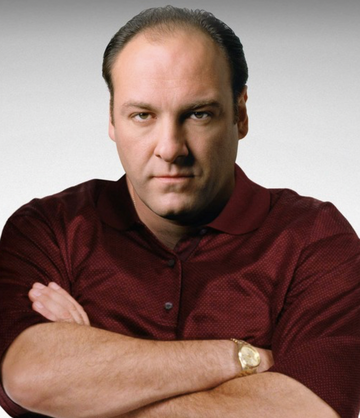
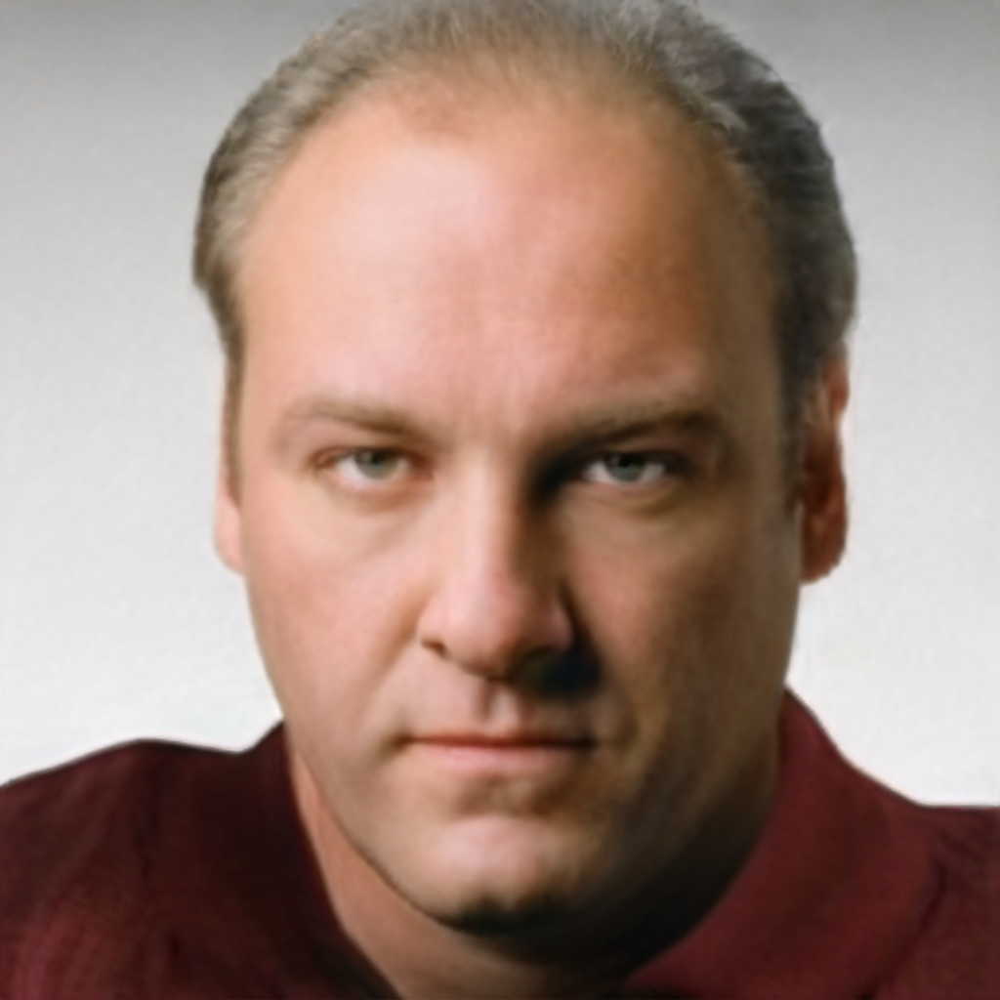
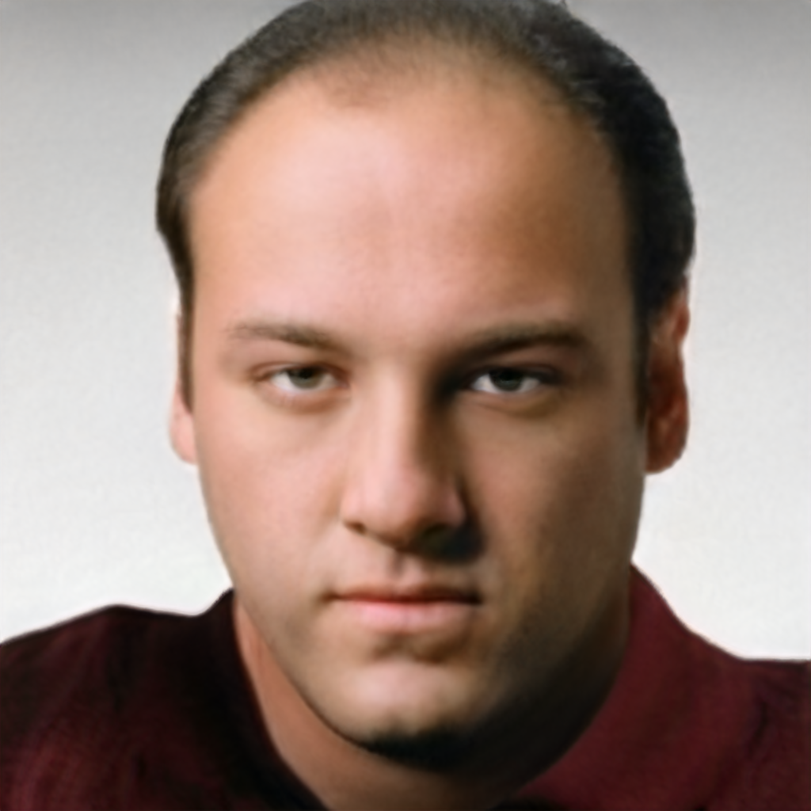
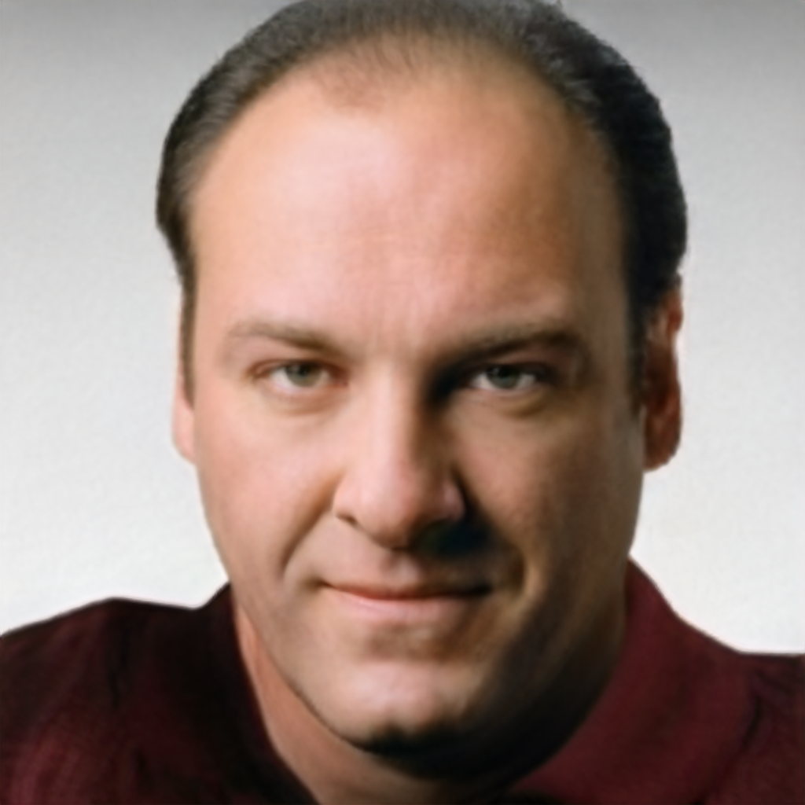
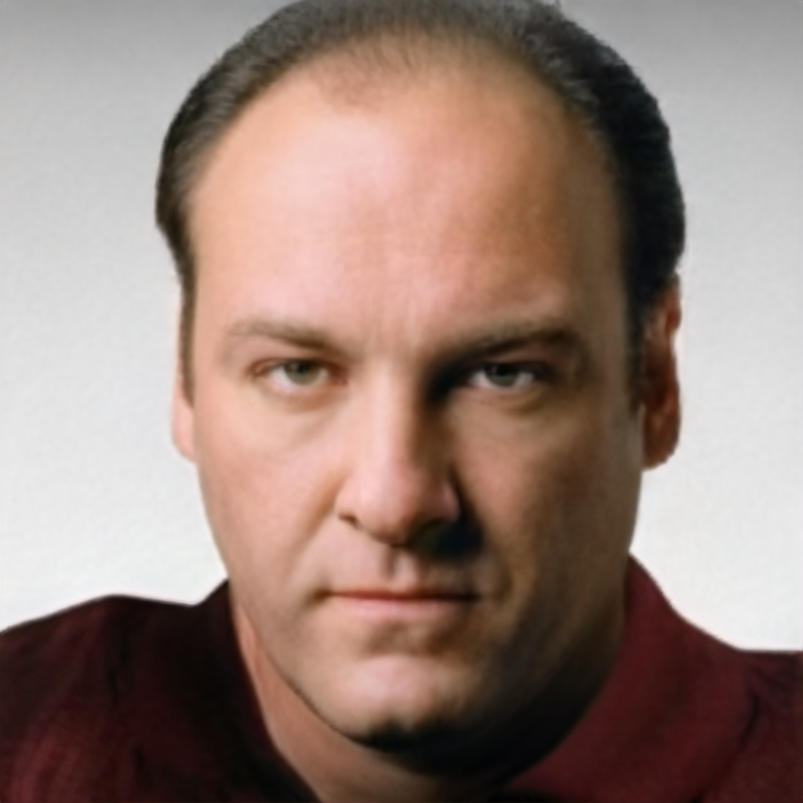

# Testing StyleCLIP

Text-driven manipulation of face images using StyleCLIP with StyleGAN2 and CLIP. This project allows you to edit facial images using natural language descriptions.

> **Note**: This repository uses modified code from [nampyohong/StyleCLIP-pytorch](https://github.com/nampyohong/StyleCLIP-pytorch). I did not implement or train any of the models - this is a testing/demonstration repository.


## Features

- **Text-Driven Editing**: Modify facial attributes using natural language prompts
- **Multiple Transformations**: Change hair color, age, expressions, pose, and more
- **High-Quality Results**: Uses StyleGAN2-ADA with FFHQ model for realistic outputs
- **Precise Control**: Adjustable manipulation strength (alpha) and disentanglement threshold (beta)

## Sample Results

All generated images

| Original | Blonde Hair | Young Face | Happy Face | Side Profile |
|----------|-------------|------------|------------|--------------|
|  |  |  |  |  |
| **Input** | **Neutral:** "bald"<br>**Target:** "thick blonde hair" | **Neutral:** "middle age face"<br>**Target:** "young face" | **Neutral:** "neutral face"<br>**Target:** "happy face" | **Neutral:** "forward facing face"<br>**Target:** "left facing face" |
| | Alpha: 1.5, Beta: 0.1 | Alpha: 1.5, Beta: 0.1 | Alpha: 1.5, Beta: 0.1 | Alpha: 1.5, Beta: 0.1 |


### Ovservations
- The model effectively changes hair color, age, expressions.
- The model struggles with pose changes.
## Installation

### Cuda Architecture
If you are using different CUDA architecture than the default (7.5), modify the `TORCH_CUDA_ARCH_LIST` variable in `config.py` before running any script.

### 1. Install Dependencies

```bash
pip install -r requirements.txt
```

### 2. Download Pre-trained Models

Run the setup script to download all required models:

```bash
python setup_models.py
```

This will download:
- **e4e_ffhq_encode.pt**: Encoder for image projection (e4e)
- **shape_predictor_68_face_landmarks.dat**: Facial landmark detector (dlib)
- **ffhq.pkl**: StyleGAN2-ADA FFHQ model
- Extract StyleCLIP directions (W, S tensors)


## Usage

### Basic Command

```bash
python infer.py -i <input_image> -o <output_image> -t "<target_prompt>" -n "<neutral_prompt>" -a <alpha> -b <beta>
```

### Parameters

| Parameter | Description | Default | Example |
|-----------|-------------|---------|---------|
| `-i, --input` | Input image path | Required | `TonySoprano.png` |
| `-o, --output` | Output image path | `output.png` | `result.png` |
| `-t, --target` | Target text prompt describing desired change | Required | `"blonde hair"` |
| `-n, --neutral` | Neutral/baseline text prompt | `"face"` | `"black hair"` |
| `-a, --alpha` | Manipulation strength (can be negative) | `2` | `1.5` or `4` |
| `-b, --beta` | Disentanglement threshold | `0.1` | `0.05` |
| `--device` | Device to use | `cuda` if available | `cuda` or `cpu` |

### Example Commands

Transform hair color:
```bash
python infer.py -i TonySoprano.png -o TonySoprano_blonde.png -t "thick blonde hair" -n "bald" -a 1.5 -b 0.1
```

Make face younger:
```bash
python infer.py -i TonySoprano.png -o TonySoprano_Young.png -t "young face" -n "middle age face" -a 1.5 -b 0.1
```

Change expression:
```bash
python infer.py -i TonySoprano.png -o TonySoprano_Happy.png -t "happy face" -n "neutral face" -a 1.5 -b 0.1
```

Change pose:
```bash
python infer.py -i TonySoprano.png -o TonySoprano_Left.png -t "left facing face" -n "forward facing face" -a 1.5 -b 0.1
```

### Implementation Details
#### Converting image to latent space
The input image is projected into the StyleGAN2 latent space using the e4e encoder.

#### Calculating Directions
The text prompts are encoded using CLIP vision transformer to compute the direction vectors in the latent space.

A direction is computed using the difference between the target and neutral text embeddings.

The direction is converted into StyleGAN's space using a pre-computed tensor mapping tensor.

#### Manipulation
The latent code is manipulated along the computed direction with specified alpha and beta values to control strength and disentanglement.

### Parameters
- **Alpha**: Controls the strength of the manipulation. Higher values lead to more pronounced changes.
- **Beta**: Controls disentanglement. Higher values preserve more original features, while lower values allow for more extensive changes.


### Conclusion
* StyleClip provides a powerful way to manipulate facial images using natural language. Allowing for changing attributes like hair color, age, and expressions with high-quality results.
* StyleClip struggles with pose changes, indicating limitations in the current approach.
